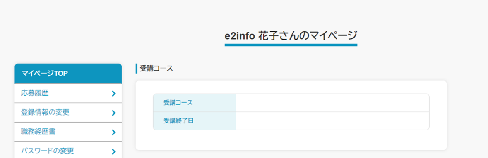

## 概要
求職者にPORTERSに連携した求職者情報(個人連絡先/レジュメ)をマイページ上に表示あるいは編集する場合、編集・表示項目設定にから行います。

例：PORTERSのレジュメで管理している受講コースを表示 

本ページでは編集・表示項目の追加～メニューに表示するまでを記載いたします。 

    
目次

    <ul>
        <li>
            <a href="#create">
                編集・表示項目を追加する
            </a>
        </li>
        <li>
            <a href="#delete">
                編集・表示項目を削除する
            </a>
        </li>
    </ul>

<h2 id="create"> 編集・表示項目を追加する</h2>

1．管理画面 > マイページ管理 > 編集・表示項目設定 に遷移します。

2．「新規登録」を押下します。 

3．フォームに各項目を入力します。 

コンテンツの設定

No. | 項目名 | 説明 | 
------------- | ------------- | ------------- |  
1 | タイトル | 編集・表示項目の名称を設定します。 メニュー内にコンテンツが複数ある場合、コンテンツ名として表示されます。
2 | 項目の編集 | 表示する登録情報を編集するか指定します。 「可」にした場合、マイページの登録情報の下に編集ボタンを表示します。

ページに登録する項目

No. | 項目名 | 説明 | 
------------- | ------------- | ------------- |  
3 | 項目追加 | 求職者に編集・表示させる項目を、一覧に追加します。 個人連絡先（Person）・レジュメ（Resume）の内、PORTERSで現在ご利用中の項目のみとなります。 詳細は<a href="https://e2info.github.io/hrdeli-docs/manual/mypage_field-setting#tips_item">［項目追加］に表示される項目について</a>をご参照ください
4 | 項目 | 「項目追加」から追加した項目の名称が表示されます。
5 | 表示名 | 求職者画面で表示する項目の名称を入力します。
6 | 入力例 | フロントの入力欄に表示する例文を入力します。 設定できるのは、テキスト1行型/テキスト複数行型/電話型/メール型の項目のみとなります。 ※「ファイル添付」の項目を追加した場合、必須/任意を表示します。 ※選択肢型の項目を追加した場合、求職者画面での表示形式（ラジオボタン/チェックボックス/ダイアログ）を展開します。
7 | 削除 | 押下した行の設定を削除します。

<dl id="tips_item" class="tips">
    <dt>［項目追加］に表示される項目について</dt>
    <dd>
        現在PORTERSの詳細画面に表示している項目が対象となります。 
        ただし例外として、会員登録時に使用しているメールアドレスの項目（フォーム設定［Emailを格納する項目］）につきましては、デフォルトのマイページメニュー「メールアドレスの変更」から変更していただく使用となるため、一覧には表示されません。 
        お手数ですがご留意のほどよろしくお願いいたします。
    </dd>
</dl>

アクティビティの追加

求職者が登録情報を更新した時、PORTERSのアクティビティ(Activity)に連携するかを設定することができます。

No. | 項目名 | 説明
------------- | ------------- | ------------- |  
8 | アクティビティの追加 | 「有効」にした場合、求職者が登録情報を更新するとPORTERSにアクティビティが新規で追加されます。 PORTERSへ連携不要な場合、［無効］にしてください。
9 | アクティビティ所有者 | PORTERS連携時のアクティビティ所有者を設定します。 ※所有者宛にメールはきません。
10 | アクティビティの件名 | PORTERS連携時の「件名（エイリアス：Activity.P_Title）」を入力します。

4． 「確認する」を押下し、確認画面に遷移します。 

5．入力内容に問題がないようでしたら、「登録する」を押下します。 

 

6．編集・表示項目設定- 一覧画面に遷移し「編集・表示項目[タイトル]を登録しました」とメッセージが表示されます。 

 
この時点では作成した編集・表示項目を、どのマイページに表示するのかが決まっていないため、マイページ管理 > メニュー設定で対象ページを指定します。

7．マイページ管理 > メニュー設定に遷移し、設定したいページの「編集」を押下します。 
※新しくメニューを追加する場合は[マイページ専用メニューの追加・削除する](https://e2info.github.io/hrdeli-docs/manual/mypage_menu)をご参照ください。 

9． 「確認する」を押下し、確認画面に遷移します。 

10．入力内容に問題がないようでしたら、「登録する」を押下します。 

11．メニュー設定 - 一覧画面に遷移し「マイページメニュー[メニュー名]を更新しました」とメッセージが表示されます。 

<h2 id="delete">編集・表示項目を削除する</h2>

    <dl class="tips">
        <dt>編集・表示項目を削除する前に</dt>
        <dd>
            削除する編集・表示項目は、現在公開中のメニューに設定していないことをご確認ください。 
            削除した編集・表示項目をメニューに設定したままの場合、該当メニューでエラーが発生し他のコンテンツが表示されなくなります。
        </dd>
    </dl>

1．管理画面 > マイページ管理 > 編集・表示項目設定 に遷移します。

2．「削除」を押下します。

3．削除確認のダイアログが展開されるので「OK」を押下します。 

[← 戻る](https://e2info.github.io/hrdeli-docs/)

